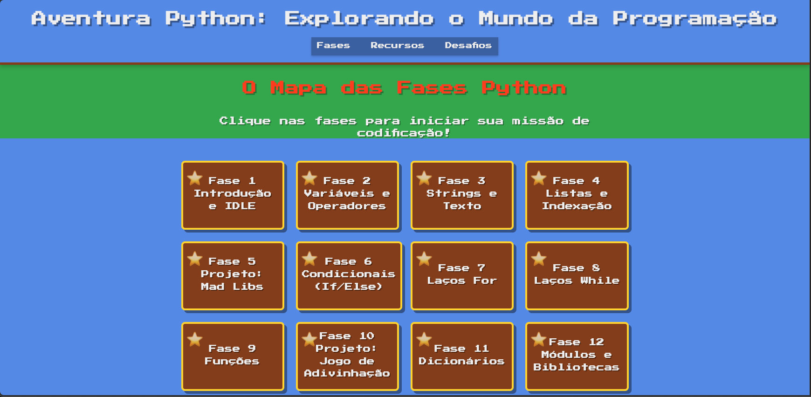
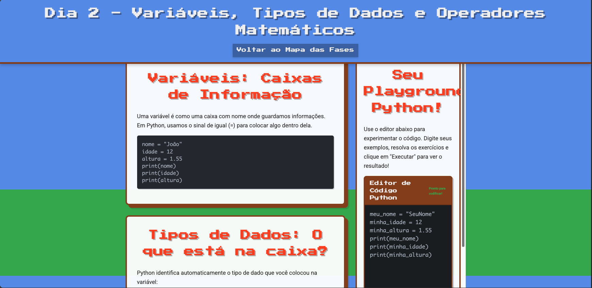

# Aventura Python: Desvendando o Reino do Código 🍄⭐

---

Bem-vindo à **Aventura Python**! Prepare-se para uma jornada épica no estilo Super Mario, onde a diversão da plataforma encontra a lógica poderosa da programação Python. Este projeto é um curso interativo e envolvente, criado para iniciantes que querem descobrir os segredos do código em um mundo inspirado nos clássicos jogos do Mario!

---

## 🗺️ Visão Geral do Reino

A Aventura Python não é apenas um curso; é uma **viagem interativa por um mapa de fases temático**, onde cada lição é um novo Bloco `?` a ser descoberto. Aqui, você não apenas lê sobre código, você o desvenda e usa para superar desafios!

Ao longo de 20 fases emocionantes, divididas em 4 semanas, você explorará os conceitos fundamentais da programação Python, desde os primeiros "Olá Mundo!" até a criação de seus próprios jogos e programas.

---

## **Demonstração Visual**




---

## 💎 Nossos Power-Ups e Recursos

- **Jornada no Mapa de Fases Mario:** Siga um mapa vibrante com imagens de fundo inspiradas nas paisagens do Mario. Cada lição é um **Bloco de Interrogação (?)** que revela seu conteúdo ao ser clicado, e se transforma em um **Bloco de Tijolos** quando visitado, mostrando seu progresso!
- **Introdução Divertida (Por que Programar?):** Uma seção especial com vídeos curtos e animados que respondem à grande pergunta: "Por que aprender a programar?". Descubra os superpoderes do código antes de iniciar.
- **IDE Interativo Integrado (Seu Terminal Estrela):**
  - Não há necessidade de instalar nada! Um **editor Python funcional** (seu terminal estrela pessoal) está **integrado diretamente em cada página de lição**.
  - Escreva e execute seu código instantaneamente, vendo os resultados na hora.
  - O IDE é "pegajoso" (`sticky`), acompanhando você enquanto rola a página, garantindo acesso contínuo à prática.
- **Música Tema do Mario (Com Controle!):** Mergulhe ainda mais na aventura com a clássica música tema do Mario tocando ao fundo. Um botão de controle permite ligar/desligar o som a qualquer momento.
- **Barra de Navegação Inteligente:** A barra de navegação principal (com links para Fases, Recursos, Desafios) agora é `sticky`, grudando no topo da tela ao rolar, mantendo os controles sempre à mão.
- **Exercícios e Dicas Dinâmicas:** Cada fase tem desafios práticos. As dicas de código ficam escondidas atrás de botões "Ver Dica de Código", incentivando a tentativa e erro.
- **Projetos Épicos:** Aplique o que aprendeu em projetos maiores e mais complexos, culminando na criação de seus próprios jogos em Python.
- **Recursos Adicionais:** Links úteis para a documentação oficial do Python e comunidades de codificação.

---

## 🛠️ Como Iniciar Sua Aventura

1.  **Clone o Repositório:**

    ```bash
    git clone [https://github.com/SEU_USUARIO/python-adventure.git](https://github.com/SEU_USUARIO/python-adventure.git)
    ```

    (Lembre-se de substituir `SEU_USUARIO` pelo seu nome de usuário do GitHub!)

2.  **Entre no Reino (Navegue):**

    ```bash
    cd python-adventure
    ```

3.  **Prepare seu Equipamento (Instale Dependências):**

    ```bash
    npm install
    ```

4.  **Ligue seu Console (Inicie o Servidor Local):**

    ```bash
    npm start
    ```

    Isso abrirá o projeto no seu navegador (geralmente em `http://127.0.0.1:5500/`).

5.  **Explore o Mapa:** Abra `index.html` e comece a clicar nas fases para minerar conhecimento e desvendar o reino do código!

---

## 🤝 Colaboração: Juntos Desvendamos Mais Segredos!

Quer adicionar uma nova fase, um power-up (funcionalidade) ou melhorar a estética do reino? Suas contribuições são muito bem-vindas!

- Sinta-se à vontade para abrir uma [issue](https://github.com/SEU_USUARIO/python-adventure/issues) para relatar bugs ou sugerir melhorias.
- Envie um [pull request](https://github.com/SEU_USUARIO/python-adventure/pulls) com suas construções de código.

---

## 📜 Licença

Este projeto está licenciado sob a [Licença MIT](https://opensource.org/licenses/MIT). Sinta-se à vontade para usar, modificar e distribuir o código conforme necessário.

---

Embarque nessa emocionante jornada de aprendizado e desbloqueie todo o potencial da programação com a **Aventura Python**! Divirta-se explorando o mundo do código e criando projetos incríveis.
