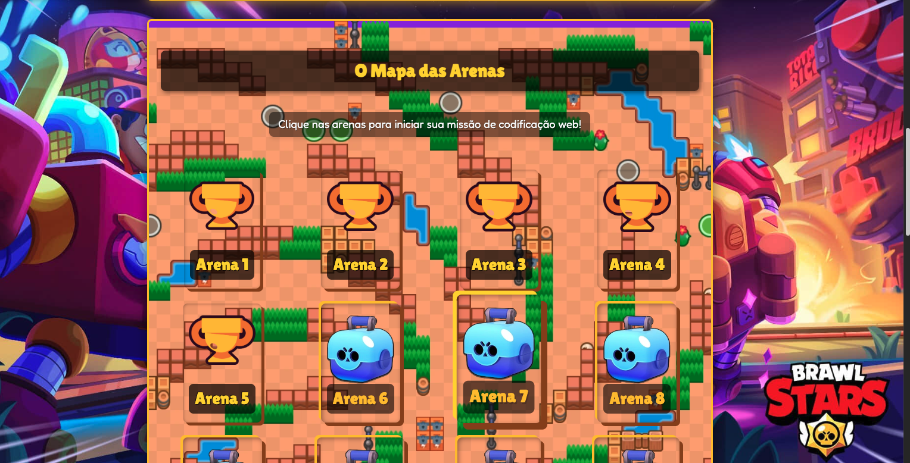
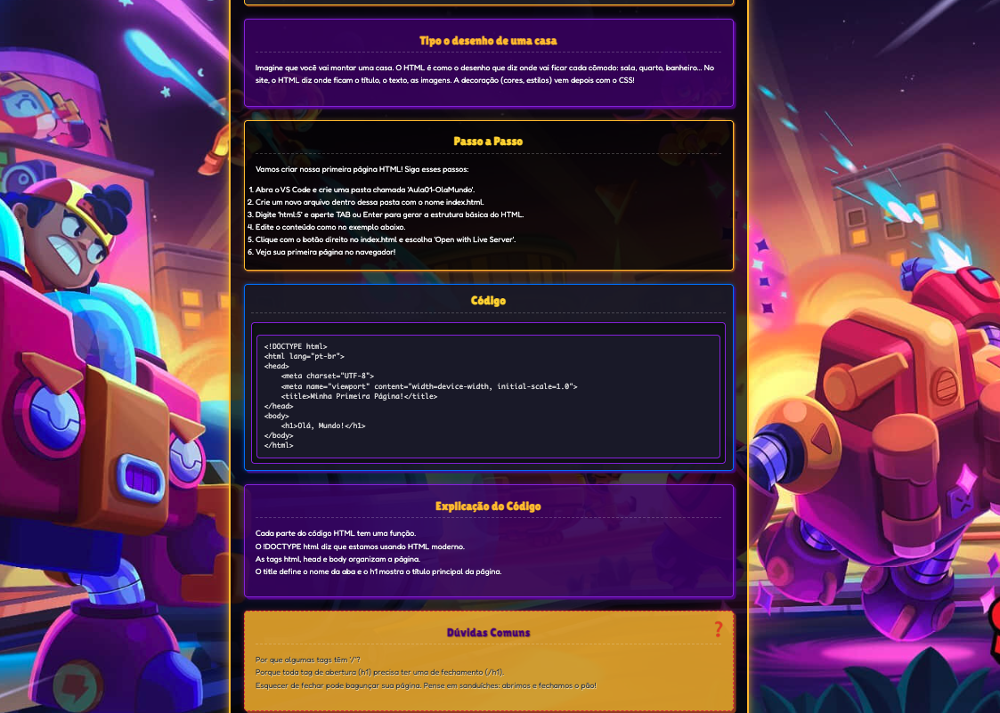

# 🌟 Brawl Stars Web Adventures: Desvende o HTML & CSS no Campo de Batalha da Web! ⚔️


_(Você pode criar um banner legal com o logo do projeto e elementos do Brawl Stars para colocar aqui!)_

---

Bem-vindo, Brawler! 🚀 Prepare-se para uma emocionante jornada onde a adrenalina das arenas do Brawl Stars encontra o poder criativo da programação web! O **Brawl Stars Web Adventures** é um curso interativo e envolvente, especialmente desenhado para jovens codificadores (e seus pais curiosos!) que querem dominar os segredos do HTML e CSS.

Chega de aulas chatas! Aqui, cada lição é uma **Arena** a ser conquistada, e cada conceito é um **Power-Up** que você ganha para construir seus próprios sites incríveis. Você está pronto para sair do lobby e entrar no mundo da criação web?

---

## 🗺️ Seu Mapa de Batalha (Visão Geral)

Este projeto te guiará por um mapa de fases vibrante, onde a diversão do universo de Brawl Stars transforma o aprendizado de HTML e CSS em uma verdadeira aventura. Do básico ao avançado, você vai:

- **Entender o HTML:** A "espinha dorsal" de todo site, como o esqueleto de um brawler!
- **Dominar o CSS:** A "maquiagem" e o estilo que deixam seu site com um visual épico, como as skins dos seus personagens favoritos!
- **Criar Projetos Incríveis:** Construa sua própria página de brawler, um mapa de arena interativo e muito mais!
- **Aprender o Workflow:** Entenda como usar ferramentas de desenvolvedor, o console do navegador e o **Git/GitHub** para salvar suas conquistas e compartilhar seu código.

### 🎮 Demonstração Visual

_(Sugestão: Adicione GIFs ou screenshots aqui quando tiver o site funcionando com os novos estilos e conteúdo!)_


_(Um screenshot do mapa de arenas com os cards estilizados)_


_(Um screenshot de uma página de lição com o código HTML/CSS e o resultado visual)_

---

## 💎 Seus Power-Ups e Recursos (Funcionalidades)

- **Mapas de Arenas Interativos:** Clique em Caixas Brawl para revelar novas lições e veja-as se transformarem em Troféus quando completadas!
- **Introduções Animadas:** Vídeos curtos que respondem à pergunta: "Por que criar sites?"
- **Exemplos de Código Interativos:** Veja o HTML e CSS em ação! Modifique o código e veja o resultado na hora, diretamente na página (sem necessidade de instalar programas complexos).
- **Explicações Claras e Divertidas:** Conceitos complexos transformados em histórias e exemplos do universo Brawl Stars.
- **Dicas Estratégicas:** Botões de "Ver Dica" para te ajudar quando você travar em um desafio.
- **Navegação Inteligente:** Barra de menu e cabeçalhos `sticky` para fácil acesso aos recursos e navegação entre as lições.
- **Controle de Áudio:** Uma trilha sonora temática de Brawl Stars para embalar seu aprendizado, com botão de ligar/desligar.

---

## 🛠️ Como Entrar na Arena (Configuração Local)

Pronto para começar a codificar? Siga estes passos para rodar o projeto no seu computador:

1.  **Pré-requisito:** Certifique-se de ter o [Git](https://git-scm.com/downloads) instalado.
2.  **Clone o Repositório:** Abra seu terminal ou Git Bash e execute:
    ```bash
    git clone [https://github.com/jbtte/brawstars-web-adventures.git](https://github.com/jbtte/brawstars-web-adventures.git)
    ```
3.  **Entre no Reino:** Navegue para a pasta do projeto:
    ```bash
    cd brawstars-web-adventures
    ```
4.  **Instale Dependências (se houver, ex: para Live Server):**
    _(Se você usa Live Server via VS Code, não precisa de `npm install`. Se tiver outras dependências JS, adicione aqui.)_
    ```bash
    # Exemplo: se usar um package.json para scripts de desenvolvimento
    npm install
    ```
5.  **Ligue seu Console (Inicie o Servidor Local):**
    _(A forma mais fácil é usar o "Live Server" do VS Code: clique com o botão direito no `index.html` e selecione "Open with Live Server".)_

    ```bash
    # Se você configurou um script 'start' no package.json (ex: 'live-server' ou 'http-server')
    npm start
    ```

    Isso abrirá o projeto no seu navegador (geralmente em `http://127.0.0.1:5500/`).

6.  **Explore o Mapa:** Clique nas "Arenas" para iniciar sua missão de codificação!

---

## 📚 Estrutura do Conhecimento (Arquivos Chave)

- `index.html`: O mapa principal das arenas.
- `day.html`: A página de cada lição/arena, onde a magia do código acontece.
- `data/lesson_index.json`: O "mapa" leve de todas as arenas para navegação.
- `data/lessons/dayX.json`: Arquivos individuais com o conteúdo de cada lição (textos, códigos, exercícios).
- `styles/`: Pasta com todos os estilos CSS (modularizados para facilitar a refatoração).
- `scripts/`: Pasta com os scripts JavaScript que dão vida à interatividade.
- `resources/images/`: Imagens do Brawl Stars para o tema.
- `resources/sounds/`: Arquivo de música tema.

---

## 🤝 Junte-se ao Esquadrão (Contribuições)

Tem uma ideia para uma nova arena? Quer melhorar a estética dos brawlers (CSS)? Encontrou um bug no mapa (código)? Suas contribuições são muito bem-vindas!

1.  Abra uma [Issue](https://github.com/jbtte/brawstars-web-adventures/issues) para relatar bugs ou sugerir melhorias.
2.  Envie um [Pull Request](https://github.com/jbtte/brawstars-web-adventures/pulls) com suas modificações.

---

## 📜 Licença: Compartilhe a Vitória!

Este projeto está licenciado sob a [Licença MIT](https://opensource.org/licenses/MIT). Sinta-se à vontade para usar, modificar e distribuir o código conforme necessário.

---

⭐ Divirta-se construindo seu próprio mundo digital com o **Brawl Stars Web Adventures**! ⭐
